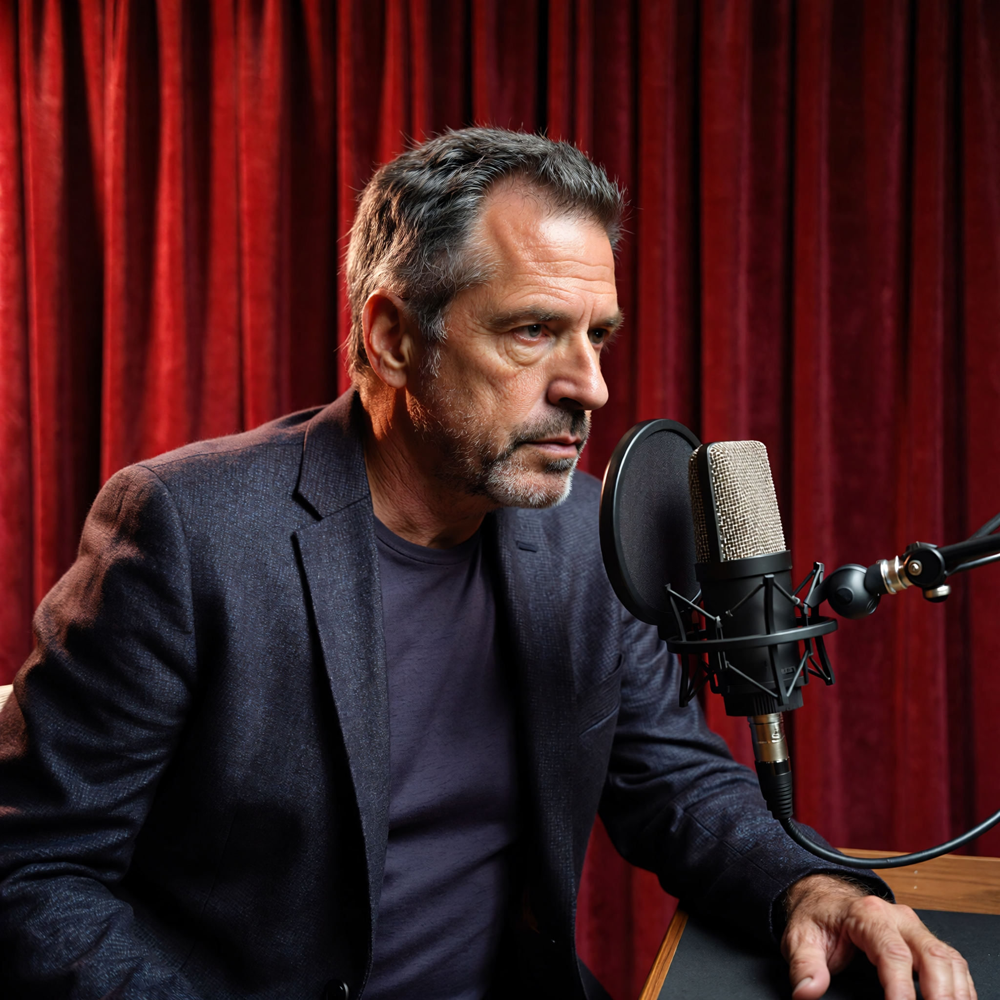
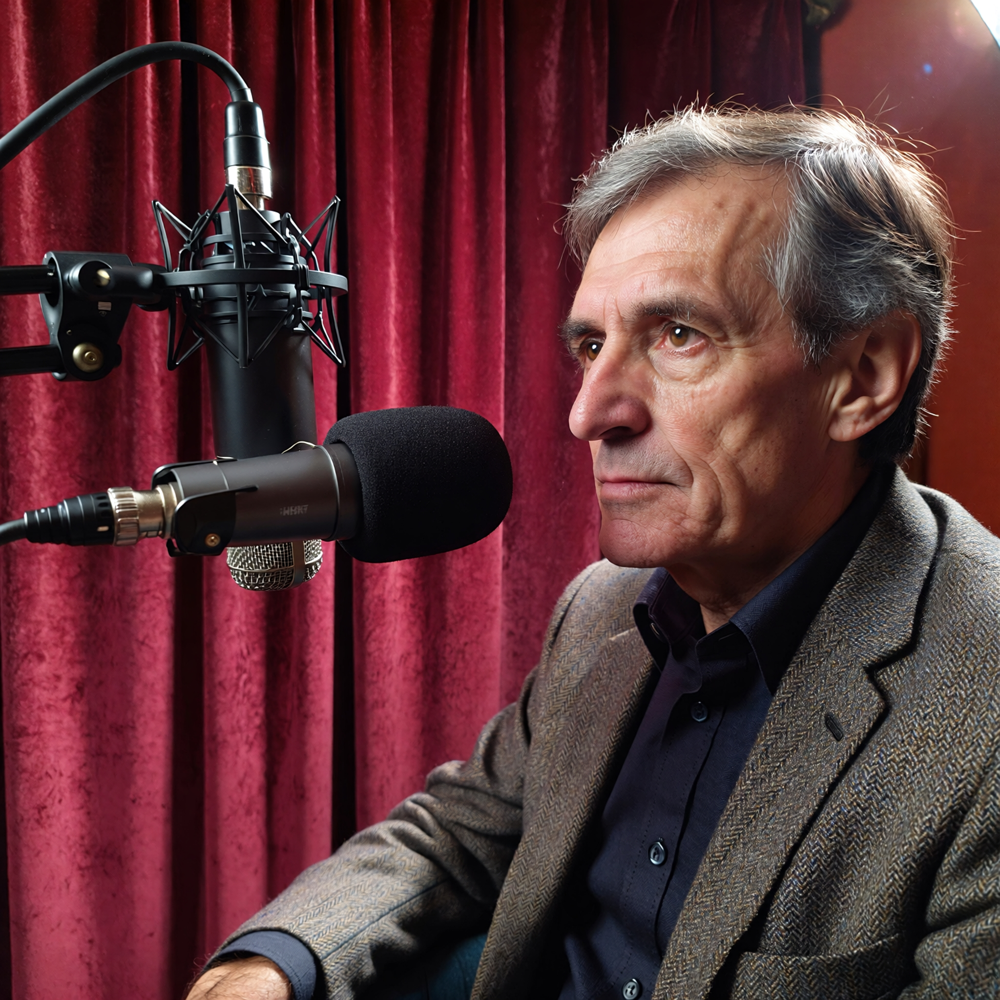

# AI Styling Project: Joe Rogan Experience Concept

## 🚀 Візуалізація результатів

<table>
  <tr>
    <td><b>Варіант 1: Психолог</b></td>
    <td><b>Варіант 2: Студія</b></td>
  </tr>
  <tr>
    <td></td>
    <td></td>
  </tr>
</table>

### 🎬 Відео-демонстрація (Kling AI)

<video src="kling_20260124_Image_to_Video_The_psycho_5304_0.mp4" controls width="600"></video>

---

## 🛠 Технологічний стек
* **Зображення:** Midjourney v6.0. Обрано через реалістичну роботу з текстурами шкіри.
* **Відео:** Kling AI. Час генерації — 3.5 хвилини.
* **QA:** Аналіз артефактів та контроль стабільності обличчя.

📬 **Контакти: 067 220 57 80**
