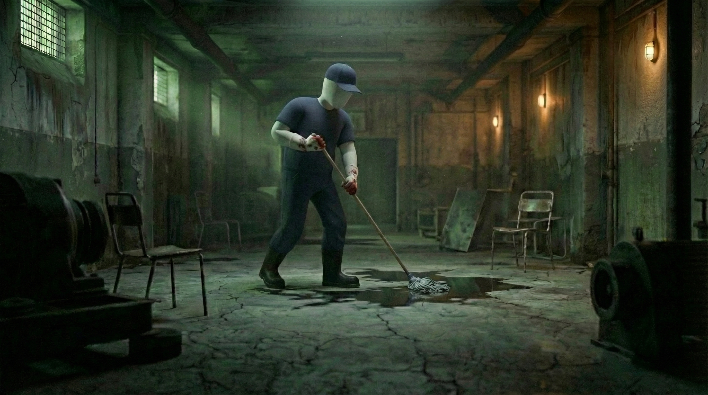

# 🎬 "The Janitor" — 3D Faceless Cinematic Micro-Series

This project showcases a high-end cinematic look-development and visual pipeline created as a technical test assignment for a mobile-first micro-series production.

---

## 📺 Production Phase 1: Dynamic Video Draft (Animatic)

> ⚠️ **Production Note:** This is an initial **v1 Draft / Animatic Test** created to evaluate action pacing, lighting shifts, and audio-to-video alignment under the original voiceover script. It contains expected early-stage AI generation drifting, which was analyzed and corrected in the next phase.

---

## 📺 Production Phase 1: Dynamic Video Draft (Animatic)

> ⚠️ **Production Note:** This is an initial **v1 Draft / Animatic Test** created to evaluate action pacing, lighting shifts, and audio-to-video alignment under the original voiceover script. It contains expected early-stage AI generation drifting, which was analyzed and corrected in the next phase.

🎬 **[Click Here to Watch / Download the Video Draft: The_Janitor_Draft_Concept.mov](./The_Janitor_Draft_Concept.mov)**

---

---

## 📌 Project Strategy: The Two-Phase Pipeline
To ensure maximum production efficiency and quality control, the project was split into two distinct execution phases:
1. **Phase 1: Video Draft & Pacing (Motion Tests):** Testing raw physics, environmental lighting dynamics, and fluid interaction using advanced text-to-video tools under script constraints.
2. **Phase 2: Look-Development & Style Locking (Final Stills):** Debugging style drifts from Phase 1 to establish a flawless, unified *3D Faceless* aesthetic across complex environments with strict character consistency.

## 🛠️ AI Toolset
* **Google Veo 3 (Flow):** Cinematic motion control, volumetric fog/lighting rendering, and liquid simulation.
* **Google Whisk:** Structural composition, environmental world-building, and character style-locking (Phase 2).
* **Suno AI:** Cinematic low-end ambient scoring and audio asset creation.

---

## 🎞️ Phase 2: Look-Development & Technical Fixes (Visual Script)

### 🛣️ Shot 1: The Hook (Opening Scene)
* **Concept Focus:** Establishing the atmospheric mood. An empty foggy highway lit only by the bright moon, followed by a dramatic bird's-eye view of a semi-truck cutting through the dense morning mist.
* **Visual Identity:** Cinematic volumetric fog and desaturated blue-grey grading.

  

---

### 🏢 Shot 2: The Setup (Inside the Vault)
* **Concept Focus:** The heist environment. High-contrast overhead spotlighting illuminating neat stacks of currency bills and administrative documents spread across a dark wooden table.
* **Visual Identity:** Rich shadows, high-fidelity texture rendering on paper/money assets.

  
  

---

### 🧹 Shot 3: The Protagonist (Character Concept)
* **Concept Focus:** Deep dive into character identity and strict visual constraints. The 3D faceless janitor profile shot standing next to a glowing wall clock, transitioning to a wide shot of him working in a dimly lit, industrial green concrete basement.
* **Technical Milestone:** Flawless isolation of the smooth, featureless matte white head geometry combined with realistic fabric folds on the work uniform.

  
  

---

### 🚨 Shot 4: The Heist & Aftermath (The Climax)
* **Concept Focus:** Narrative storytelling through environment. The janitor carrying a disposal bin, blending in while moving past corporate management and white-collar personnel. Cut to the aftermath: a completely ransacked office floor littered with documents and dramatic crime scene elements (blood tracking).
* **Technical Milestone:** Maintaining stable object placement and structural continuity between the populated office scene and the destroyed aftermath scene.

  
  
  

---

## ⚙️ Key Technical Takeaways & QA Insights (Prompt Engineering Analysis)

* **Style Drifting & Concept Bleeding:** In the initial video draft (0:56), text-to-video models heavily defaulted to rendering standard human faces and corporate suits due to dataset bias. To bypass this, strict negative tokens were introduced in Phase 2 to suppress facial anatomy.
* **Character Mutation Control:** Observed prompt degradation between cuts where the smooth white head mutated into standard mannequin textures (1:04). This was successfully solved in the final look-development stills by implementing structural image-to-image anchoring via Google Whisk.
* **Environmental Consistency:** Successfully locked the cinematic lighting models (volumetric fog, high-contrast overhead spots) across shifting locations, eliminating unwanted color artifacts found in early video iterations.
